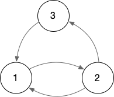

= Mortal Fibonacci Rabbits

Notes on solving http://rosalind.info/problems/fibd/.

== Using a list for rabbits

My first solution will produce a correct answer but is inefficient such that it would not complete in the 5 minute window for giving an answer.
The reason is because I use a `list` to represent each rabbit as an age.
Those that reach the maximum age (`args.m`) are reaped, but the growth is such that the program would stop working after about 30 generations.
This is well short of the 80+ generations required to the satisfy the test where there are something like 10e19 rabbits, meaning I need Python to allocate a `list` of that many integer values!

----
def main():
    def gen(n): <1>
        return [1] if n == args.m else [2] if n == 1 else [n + 1, 1] <2>

    fib = [1]   <3>
    for i in range(args.n - 1): <4>
        fib = list(chain.from_iterable(map(gen, fib))) <5>

    print(len(fib)) <6>
----

<1> The `gen()` function will return the next generation for a given pair of rabbits according to their age.
<2> If the rabbits have reached the maximum age, they create their offspring (who will be 1 month old in the next generation) and die. If the rabbits are 1 month old, they only carry themselves forward as 2 months old. Otherwise, the rabbits will be one month older and will also create offspring who will be 1 month old next time.
<3> Start off with one pair of rabbits who are 1 month old.
<4> Iterate through the number of months (`args.n`).
<5> Each number in `fib` is the age of a pair of rabbits. Use `map()` to process each to create the next generation. The resulting data structure will be a `list` of lists which need to be flattened into a single list by `chain.from_iterable()`. This is a lazy function, so we need to further coerce it using the `list()` function. We can overwrite the `fib` variable each time as we don't need to keep track of every generation to answer this problem.
<6> The length (`len()`) of the `fib` list is the number of pairs of rabbits left after iterating through the generations.

Let's talk about the `gen()` function for a bit.
Given the age of a mate pair, the function will produce a `list` of ages of the next generation of rabbits according to these rules:

. Rabbits age 1 month cannot reproduce, so they can only age to 2.
. Rabbits who have reached the maximum age can reproduce but not carry forward and so will only yield a 1.
. Rabbits 2 months or older (who have not reached maxium age) can reproduce and age, so they will yield their age plus one and a 1.

NOTE: The `gen()` function is defined _inside_ the `main()` function so that it can refer to the `args.m` (maxium age) value. This creates a "closure" as the function "closes around" that value.

The `gen()` function essentially creates a _finite state machine_.
For a maximum value of 3, we have the following rules:

. 1 -> 2
. 2 -> 1, 3
. 3 -> 1

We can define `gen()` in the REPL, but we need to change `args.m` to just the variable `m`.
You must press Enter twice to create a blank line so that Python knows you are done with the definition:

----
>>> m = 3
>>> def gen(n):
...     return [1] if n == m else [2] if n == 1 else [n + 1, 1]
...
----

Let's start off with our initial pair of 1-month-old rabbits:

----
>>> fib = [1]
----

Using `map()` to push any generation through this function to produce the next generation creates a list of lists:

----
>>> list(map(gen, fib))
[[2]]
----

But we want to "flatten" this into a single list like `[2]`.
We can import the `itertools.chain()` function to do this:

----
>>> from itertools import chain
----

Note that this is a lazy function, so I use the `list()` function to coerce the values:

----
>>> list(chain.from_iterable(map(gen, fib)))
[2]
----

I overwrite the value of `fib` on each iteration as we only need to track the latest generation:

----
>>> fib = list(chain.from_iterable(map(gen, fib)))
>>> list(chain.from_iterable(map(gen, fib)))
[3, 1]
----

As noted, this version will choke around 30 generations on my laptop.
A machine with more memory might be able to go further, but it's not advisable.

Let's add a few `print()` commands to see how `fib` changes over time:

----
fib = [1]                   <1>
for i in range(args.n - 1): <2>
    print(i, fib)           <3>
    fib = list(chain.from_iterable(map(gen, fib)))

print('end', fib)           <4>
print(len(fib))
----

<1> The first generation happens before the `for` loop.
<2> The `range()` uses `args.n - 1` because the first generation is given.
<3> Print the iteration and the ages of the rabbits.
<4> Print the final version.

If we run this, we can trace how our rabbits multiply and die:

----
0 [1]              <1>
1 [2]              <2>
2 [3, 1]           <3>
3 [1, 2]           <4>
4 [2, 3, 1]        <5>
end [3, 1, 1, 2]   <6>
----

<1> Initially we have 1 pairs of rabbits that are 1 month old. They are too young to mate, and so carry forward into the next generation.
<2> Now our initial pair are 2 months old and can mate to produce a pair that are 1 month old. The current pair age into 3 months old.
<3> The 3-month-old pair can mate one last time to produce the 1 in the next iteration, but then they die.
<4> The 1 from before age to 2, the 2 from before age to 3 and also produce a new 1.
<5> The 1 ages to 2, the 2 age to 3 and produce a 1.
<6> At the end, the 2 ages to 3 and produces a 1, the 3 produces a 1 and dies, and the 1 ages to 2. We are left with 4 pairs of rabbits.

== Using a dict/bag instead of a list

I thought my previous solution was good as it worked well for the example case of 6 generations (`n`) living 3 months each (`m`).
This approach failed miserably, however, with anything value of `n` over 30, so I had to find another solution.
I stepped away for a few hours, and the answer struck me just as I was trying to fall asleep.

To me, the solution lay in the fact that I should be counting the numbers of rabbits at each each age using a dictionary rather than using a list to represent each pair individually.
For instance, notce how at the end there are two 1s?
Another way to represent this would be as a "bag" footnote:[https://en.wikipedia.org/wiki/Bag-of-words_model] of items and their frequencies.

The `collections.Counter()` function can produce a dictionary showing the frequencies of each item in a sequence such as our `list` of ages:

----
>>> from collections import Counter
>>> Counter([3, 1, 1, 2])
Counter({1: 2, 3: 1, 2: 1})
----

The keys of this dictionary are the ages in months, and the values are the number of rabbits who are that age.
Now the answer can be had by adding the values of the dictionary:

----
>>> fib = Counter([3, 1, 1, 2])
>>> sum(fib.values())
4
----

In order to track the rabbits using a dictionary, I need to know the number of rabbits who will age and the number of rabbits who will be born in each iteration/generation.
My previous `gen()` function returned a variable-length `list`, which won't do.
I changed it to return a `tuple` showing the next age of this generation and the age of the progeny, both of which could be 0 according to the rules above.

Here is the entire solution:

----
def main():
    """Make a jazz noise here"""

    args = get_args()

    def gen(n: int) -> (int, int): <1>
        """
        n: age in months
        return: (next age of this generation, age of progeny)
        """
        return (0, 1) if n == args.m else (2, 0) if n == 1 else (n + 1, 1)

    # fib: list of dicts where key = age in month, value = number that age
    fib = [{1: 1}]                       <2>
    for _ in range(args.n - 1):          <3>
        next_gen = defaultdict(int)      <4>
        for age, num in fib[-1].items(): <5>
            # Copy the "num" to the next generation and progeny
            for val in filter(lambda n: n > 0, gen(age)): <6>
                next_gen[val] += num     <7>
        fib.append(next_gen)             <8>

    print(sum(fib[-1].values()))         <9>
----

<1> The `gen()` function is now annotated with types showing that it will accept an integer value and return a pair of integers.
<2> The initial state is 1 pair of 1-month-old rabbits.
<3> We are only using `range()` to repeat the loop a certain number of times. As we don't need the values produced, we can use `_` to indicate this is a throwaway valuye.
<4> The next generation will be represented using a `defaultdict` with integer values.
<5> Iterate through each age/number pair from the previous generation.
<6> Use the `gen()` function to determine the next generation's ages. The `for` loop will iterate through each value in the returned `tuple`. Use a `filter()` to skip the values that are 0.
<7> Add any non-zero age to the next generation's count for that age.
<8> Append the next generation to the list. Note that we could have just overwritten `fib` like before as we really only need the last generation's data.
<9> The final answer is the `sum()` of the values from the last generation.

== Using reduce

Another option that borrows from the realm of purely functional programming is to use the `functools.reduce` function:

----
def main():
    """Make a jazz noise here"""

    args = get_args()

    def generation(n: int) -> (int, int):
        """
        n: age in months
        return: (next age of this generation, age of progeny)
        """
        return (0, 1) if n == args.m else (2, 0) if n == 1 else (n + 1, 1)

    def fib(acc, _): <1>
        next_gen = defaultdict(int)
        for age, num in acc.items(): <2>
            # Copy the "num" to the next generation and progeny
            for val in filter(lambda n: n > 0, generation(age)):
                next_gen[val] += num
        return next_gen <3>

    last = reduce(fib, range(args.n - 1), {1: 1}) <4>
    print(sum(last.values())) <5>
----

<1> The `fib()` function uses the `gen()` function, so they both need to be in the same scope, hence this function is also declared inside `main()`. The body of the function is the body of the previous `for` loop. The function will receive the "accumulated" data structure and the next value to process. In this case, the value produced is based solely on the immediately previous value, which is why we use `_` in the last solution to discard it. We can do likewise here.
<2> The accumulator will have the previous iteration's dictionary. 
<3> A reduction operation is often used to merge data structures, but here we'll abuse it slightly to return just the new data structure for the next generation.
<4> The `reduce()` will apply a given function to all the elements from a given sequence using a given starting value. It will produce just the last generation.
<5> The last generation is a dictionary of the age/number pairs.

Note the documentation for `reduce`:

----
reduce(...)
    reduce(function, sequence[, initial]) -> value

    Apply a function of two arguments cumulatively to the items of a sequence,
    from left to right, so as to reduce the sequence to a single value.
    For example, reduce(lambda x, y: x+y, [1, 2, 3, 4, 5]) calculates
    ((((1+2)+3)+4)+5).  If initial is present, it is placed before the items
    of the sequence in the calculation, and serves as a default when the
    sequence is empty.
----
